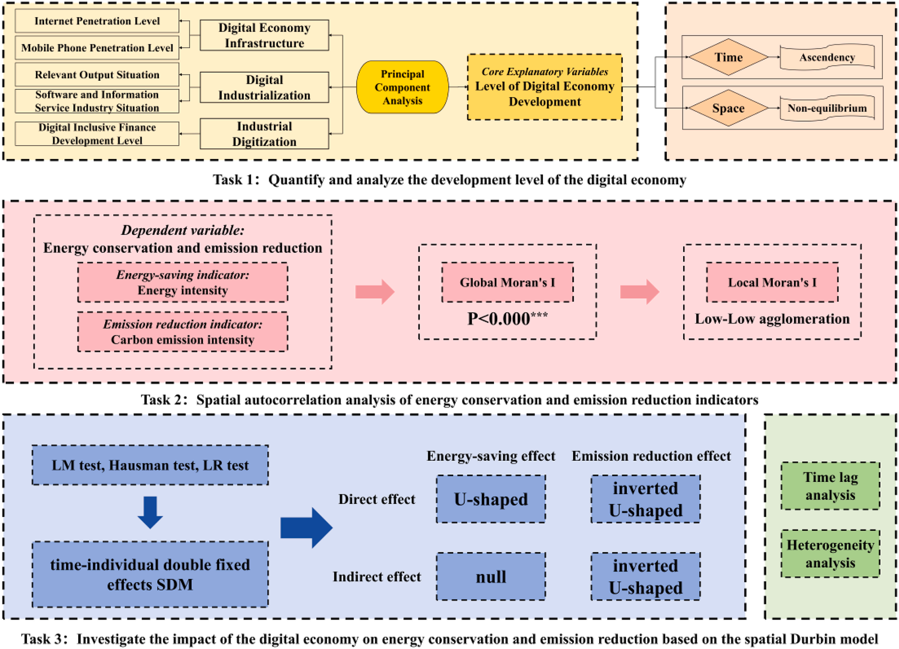
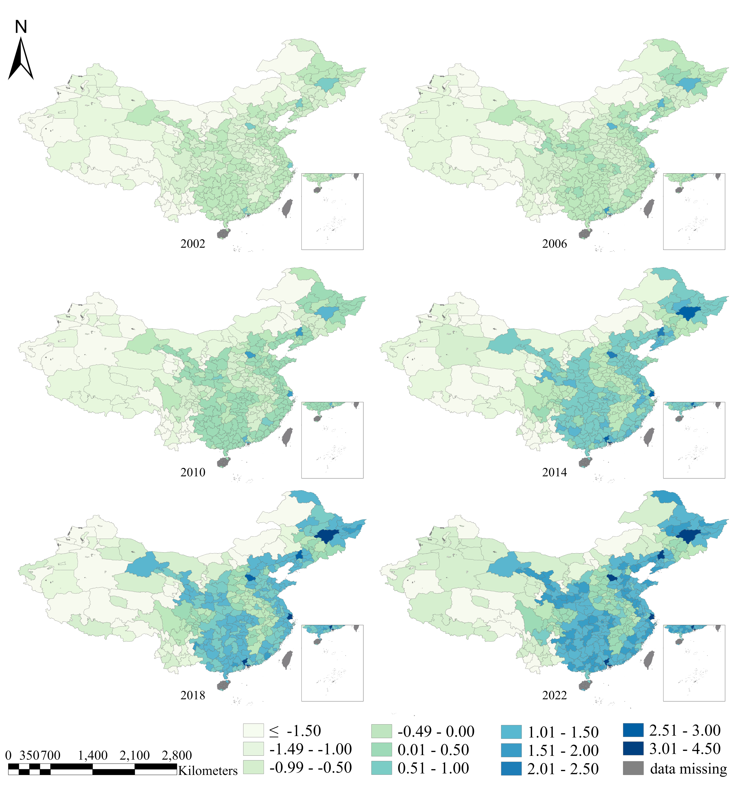
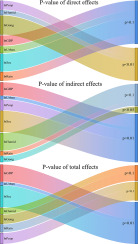
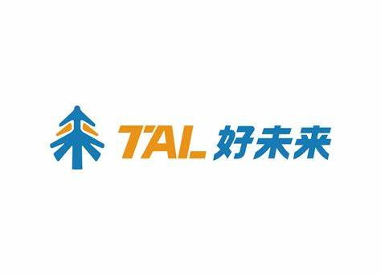








# Welcome! 
I am now a senior student at [China University of Geosciences (Beijing)](www.cugb.edu.cn). Fortunately, I am under the guidance of Prof. [Li Li](https://scholar.cugb.edu.cn/scholar/scholarDetail/620.shtml) from the School of Economics and Management. During my junior year, I published three SCI papers.

Since July 2024, I have been working as a daily intern at [TAL Education Group](https://www.100tal.com/) in Beijing, responsible for business data analysis and AI-related tasks, under the supervision of Ms. Han Zhou.

My research interests include energy economics, environmental economics, and machine learning. **Presently, I am deeply involved in specific projects related to new productive forces for my undergraduate thesis research**.

You can find my resume here: [Cheng Zhang's Curriculum Vitae](../assets/Curriculum_Vitae.pdf). If you are interested in my work, please feel free to drop me an [email](mailto:zorange411@gmail.com).

I hope this helps you better understand my background and research directions.

# 🔥 News
- *2024.10*: &nbsp;🎉🎉 Awarded the **First-Class Professional Scholarship** (TOP 5%).
- *2024.10*: &nbsp;🎉🎉 Awarded the **National Scholarship for Undergraduates** (TOP 0.2%).
- *2024.09*: &nbsp;🎉🎉 Admitted to **Xiamen University** for Pursuing a Master's Degree.
- *2024.08*: &nbsp;🎉🎉 New Paper Accepted by **Sustainable Futures** (IF=3.3). 
- *2024.08*: &nbsp;🎉🎉 New Paper Accepted by **Journal of Cleaner Production** (IF=9.7).
- *2024.06*: &nbsp;🎉🎉 New Paper Accepted by **Science of The Total Environment** (IF=8.2).

# 📝 Publications 
- 🎓During My Undergraduate Program

Journal of Cleaner Production

[The coordinated development among economy, society, energy, and environment and their impacts on public health in China's cities](https://www.sciencedirect.com/science/article/abs/pii/S0959652624028919?via%3Dihub=)

**Cheng Zhang**, Meiyu Jiang, Fujie Yang, Yuehan Wang, Yaxin Xu, Sihan Lin, Li Li, Yalin Lei, Sanmang Wu, Jiao Wang

[**Project**](https://www.sciencedirect.com/science/article/abs/pii/S0959652624028919?via%3Dihub=) | <strong>SCI Journal Paper</strong> (CAS Q1, IF=9.7)
- Journal of Cleaner Production, Volume 472, 2024, doi: 10.1016/j.jclepro.2024.143442.

<!--
[**Project**](https://scholar.google.com/citations?view_op=view_citation&hl=zh-CN&user=DhtAFkwAAAAJ&citation_for_view=DhtAFkwAAAAJ:ALROH1vI_8AC) <strong></strong>
- Lorem ipsum dolor sit amet, consectetur adipiscing elit. Vivamus ornare aliquet ipsum, ac tempus justo dapibus sit amet. 

-->

Sustainable Futures

[The impact of digital economy on energy conservation and emission reduction: evidence from prefecture-level cities in China](https://www.sciencedirect.com/science/article/pii/S2666188824001370#abs0001)

**Cheng Zhang**, Yirui Zhang, Hua Zhang, Jiaying You, Xinke Lv, Xinyu Cheng

[**Project**](https://www.sciencedirect.com/science/article/pii/S2666188824001370#abs0001) | <strong>SCI Journal Paper</strong> (CAS Q2, IF=3.3)
- Sustainable Futures, Volume 8, 2024, doi: 10.1016/j.sftr.2024.100288.

<!--
[**Project**](https://scholar.google.com/citations?view_op=view_citation&hl=zh-CN&user=DhtAFkwAAAAJ&citation_for_view=DhtAFkwAAAAJ:ALROH1vI_8AC) <strong></strong>
- Lorem ipsum dolor sit amet, consectetur adipiscing elit. Vivamus ornare aliquet ipsum, ac tempus justo dapibus sit amet. 

-->

Science of The Total Environment

[Spatio-temporal differentiation characteristics and the influencing factors of PM2.5 emissions from coal consumption in Central Plains Urban Agglomeration](https://www.sciencedirect.com/science/article/abs/pii/S0048969724039251#preview-section-references)

Fujie Yang, Jiayi Yu, **Cheng Zhang**, Li Li, Yalin Lei, Sanmang Wu, Yibo Wang, Xin Zhang

[**Project**](https://www.sciencedirect.com/science/article/abs/pii/S0048969724039251#preview-section-references) | <strong>SCI Journal Paper</strong> (CAS Q1, IF=8.2)
- Science of The Total Environment, Volume 945, 2024, doi: 10.1016/j.scitotenv.2024.173778.

<!--
[**Project**](https://scholar.google.com/citations?view_op=view_citation&hl=zh-CN&user=DhtAFkwAAAAJ&citation_for_view=DhtAFkwAAAAJ:ALROH1vI_8AC) <strong></strong>
- Lorem ipsum dolor sit amet, consectetur adipiscing elit. Vivamus ornare aliquet ipsum, ac tempus justo dapibus sit amet. 

-->
# 🎖 Honors and Awards
- *2024.10* National Scholarship for Undergraduates (Top 0.2%)
- *2023.09* Merit student (Top 5%)
- *2022.09* Outstanding student leader (Top 5%)
- *2023.12* Love at the Cabbage Hundred • Golden Future Scholarship (Top 5%)
- *2021-2024* Professional first-class scholarship (three times) (Top 5%)

# 📖 Educations
- *2021.09 - 2025.06*, Bachelor of Economics, China University of Geosciences Beijing, China, Supervised by Prof. Li Li
- *2025.09 - 2028.06*, Master of Laws, Xiamen University

# 💬 Invited Talks
- *2024.10*, CUGB School of Economics and Management wechat public account, [special report](https://mp.weixin.qq.com/s/KvCJS7LLfG1tSzkGELhFOw). 

# 💻 Internships
- 🎓During My Undergraduate Program

TAL

  
*2024.07 - now*, [TAL Education Group](https://www.100tal.com/), China.

- **Business Data Analytics and AI Engineer**
- Advised by Ms. Han Zhou
- Jul. 2024 - Dec. 2024

