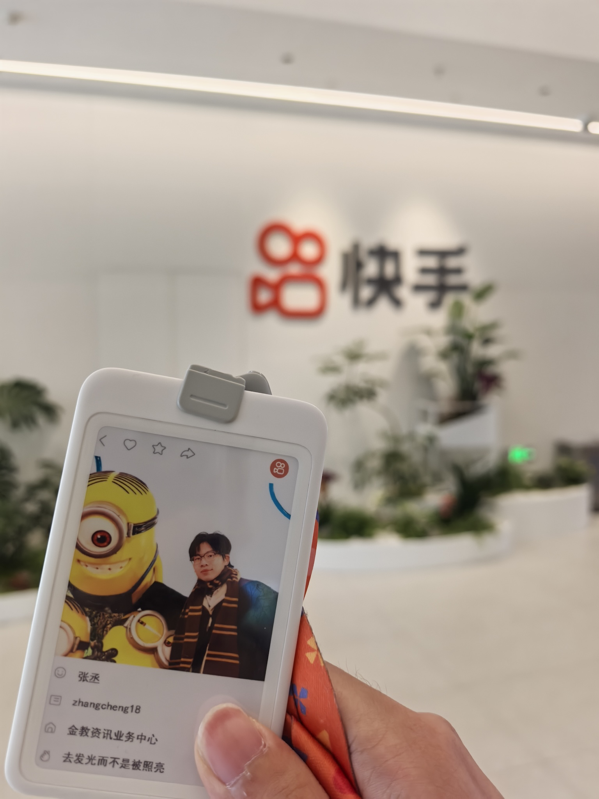








# 欢迎! 
> 我现为[厦门大学社会学](https://ssa.xmu.edu.cn/)研一学生。本科毕业于[中国地质大学（北京）经济学](https://sem.cugb.edu.cn/)专业，有幸师从[李莉教授](https://scholar.cugb.edu.cn/scholar/scholarDetail/620.shtml) ，在能源经济学领域开展了多项研究工作。我的研究兴趣涵盖能源经济学、环境经济学、社会经济社会学及机器学习等领域，目前正聚焦新质生产力相关专项课题。
> 
> 2024年7月至11月期间，我在[好未来教育集团](https://www.100tal.com/)担任LBS渠道运营实习生，在周函老师的指导下负责业务数据分析及人工智能相关任务。
> 2025年2月至8月期间，我在[快手](https://www.kuaishou.com/new-reco)担任商业化行业运营实习生，在于宸老师、张磊老师的指导下专注于商业广告数据分析。
> 
> 如果您对我的研究工作感兴趣，欢迎通过[邮箱](mailto:zorange411@gmail.com)与我联系。希望以上介绍能帮助您更好地了解我的学术背景与研究方向。

# 🔥 近期动态
- *2025.05*: &nbsp;💡 新的思考["时间管理的金融工程学：一个拖延者的理论重构——关于QE、QT与人生债务的跨学科对话"](https://zhuanlan.zhihu.com/p/1892310880248640651).
- *2024.10*: &nbsp;🎖️ 获得本科生**国家奖学金** (TOP 0.2%).
- *2024.09*: &nbsp;📖 保研至**厦门大学**攻读硕士学位.
- *2024.08*: &nbsp;🎉 学术论文发表于 **Sustainable Futures** (第一作者，中科院二区，IF=3.3). 
- *2024.08*: &nbsp;🎉 学术论文发表于 **Journal of Cleaner Production** (第一作者，中科院一区TOP，IF=9.7).
- *2024.06*: &nbsp;🎉 学术论文发表于 **Science of The Total Environment** (第三作者，中科院一区TOP，IF=8.2).

# 📖 教育经历
- *2021.09 - 2025.06*, 中国地质大学（北京），经济学学士学位，导师：李莉教授
- *2025.09 - 2028.06*, 厦门大学，法学硕士学位，导师：徐延辉教授

# 📝 学术论文与个人博客

Journal of Cleaner Production

[The coordinated development among economy, society, energy, and environment and their impacts on public health in China's cities](https://www.sciencedirect.com/science/article/abs/pii/S0959652624028919?via%3Dihub=)

**Cheng Zhang**, Meiyu Jiang, Fujie Yang, Yuehan Wang, Yaxin Xu, Sihan Lin, Li Li, Yalin Lei, Sanmang Wu, Jiao Wang

[**Project**](https://www.sciencedirect.com/science/article/abs/pii/S0959652624028919?via%3Dihub=) | Journal of Cleaner Production, Volume 472, 2024, doi: 10.1016/j.jclepro.2024.143442.(第一作者，中科院一区TOP, IF=9.7)

Sustainable Futures

[The impact of digital economy on energy conservation and emission reduction: evidence from prefecture-level cities in China](https://www.sciencedirect.com/science/article/pii/S2666188824001370#abs0001)

**Cheng Zhang**, Yirui Zhang, Hua Zhang, Jiaying You, Xinke Lv, Xinyu Cheng

[**Project**](https://www.sciencedirect.com/science/article/pii/S2666188824001370#abs0001) | Sustainable Futures, Volume 8, 2024, doi: 10.1016/j.sftr.2024.100288.(第一作者，中科院二区, IF=3.3)

Science of The Total Environment

[Spatio-temporal differentiation characteristics and the influencing factors of PM2.5 emissions from coal consumption in Central Plains Urban Agglomeration](https://www.sciencedirect.com/science/article/abs/pii/S0048969724039251#preview-section-references)

Fujie Yang, Jiayi Yu, **Cheng Zhang**, Li Li, Yalin Lei, Sanmang Wu, Yibo Wang, Xin Zhang

[**Project**](https://www.sciencedirect.com/science/article/abs/pii/S0048969724039251#preview-section-references) | Science of The Total Environment, Volume 945, 2024, doi: 10.1016/j.scitotenv.2024.173778. (第三作者，中科院一区TOP, IF=8.2)

知乎

  
["时间管理的金融工程学：一个拖延者的理论重构——关于QE、QT与人生债务的跨学科对话"](https://zhuanlan.zhihu.com/p/1892310880248640651).

张丞，DeepSeek2025.04

# 💻 实习经历

好未来

  
*2024.07 - 2024.11*, [好未来教育集团](https://www.100tal.com/), 北京.

- **商业数据分析与AI产品运营**
- mt/ld：周函老师
- 商业数据运营(40%)：大众点评/美团渠道日常数据的统计、原因分析，运用Excel和SQL定期输出数据报告
- 模型搭建与数据探索(30%)：运用ProcessOn搭建客资链路增长模型，并利用SPSS和Python定量分析指标因果关系，挖掘业务增长点。此外，运用Origin搭建健康度诊断模型，负责青岛、宁波等校的诊断分析
- AI产品(30%)：基于Dify的RAG 检索功能搭建工作流，对客诉文本进行清洗与处理，每月节约3个工作日

快手

  
*2025.02 - 2025.08*, [快手](https://www.kuaishou.com/new-reco), 北京.

- **商业化行业运营**
- mt/ld：于宸老师、张磊老师
- 日常数据运营(40%)：围绕商业化广告业务，基于快手天玑、KwaiBI平台，独立编写SQL、制作看板，开展日报、周报、[对外双周报](https://docs.qingque.cn/d/home/eZQB2WZr3Teq6qfvxxOXPBXEm?identityId=2FbI2dajR7T#section=h.5i0qm9u1c429)等数据的提取统计、处理分析、可视化、结论展示，定期输出报告
- 项目制数据分析(40%)：支持业务数据分析工作，采集数据并进行加工分析、归纳整理，产出业务分析与建议
- 行业运营(20%)：辅助完成商业化运营工作，主动发现业务问题，提报并追踪工单，推动多方解决客户问题
- AI产品(10%)：基于Luigi搭建工作流，对通信行业的广告组H5落地页与视频素材进行打标分类

# 🎖️ 竞赛获奖
1.美国大学生数学建模竞赛Honorable Mention两次-作品1、作品2	 第一负责人，国家级

2.iCAN大学生创新创业大赛“商道杯”管理决策模拟挑战赛全国三等奖	 第一负责人，国家级

3.高教社杯全国大学生数学建模竞赛北京市一等奖-作品	 第一负责人，省部级

4.“学创杯”全国大学生创业综合模拟比赛北京市二等奖	 第一负责人，省部级

5.蓝桥杯全国软件和信息技术专业人才大赛C++程序设计北京市三等奖	   个人参赛，省部级
