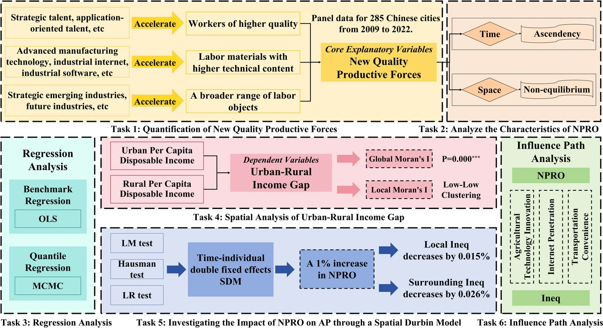
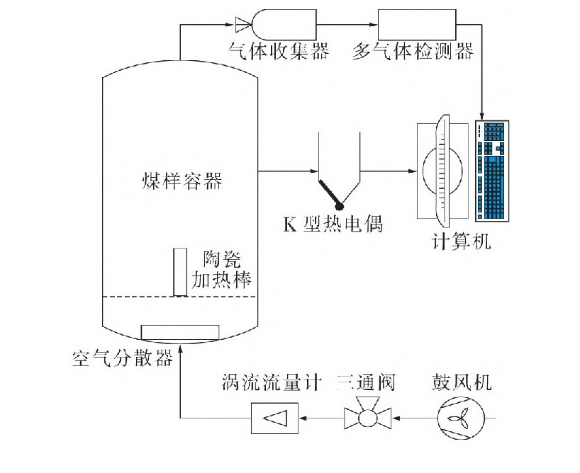
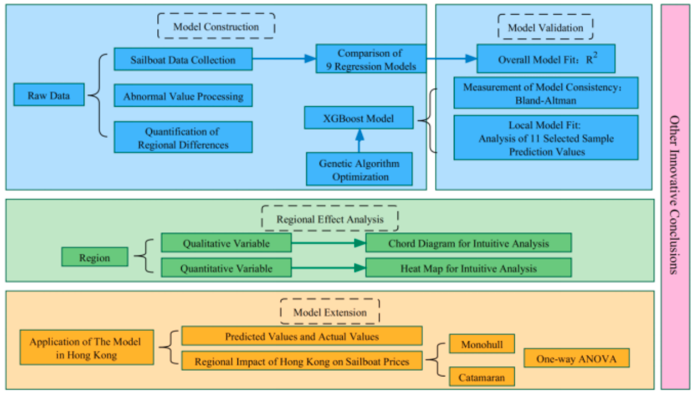
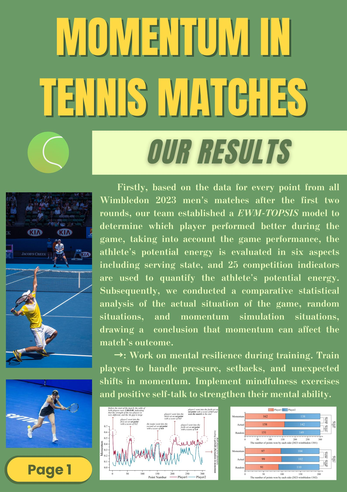








# 欢迎! 
> 我现为[厦门大学社会学](https://ssa.xmu.edu.cn/)研一学生，有幸师从[徐延辉教授](https://ssa.xmu.edu.cn/info/1190/1152.htm)。本科毕业于[中国地质大学（北京）经济学](https://sem.cugb.edu.cn/)专业，有幸师从[李莉教授](https://scholar.cugb.edu.cn/scholar/scholarDetail/620.shtml) ，在能源经济学领域开展了多项研究工作。我的研究兴趣涵盖能源经济学、环境经济学、经济社会学及机器学习等领域。
> 
> 2024年7月至11月期间，我在[好未来](https://www.100tal.com/)担任商业数据分析实习生，在周函老师的指导下负责数据分析与用户研究。
> 2025年2月至8月期间，我在[快手](https://www.kuaishou.com/new-reco)担任商业化行业运营实习生，在于宸老师、张磊老师的指导下专注于商业广告数据分析，并在空余时间探索AI在业务中的应用。
> 
> 如果您对我的研究工作感兴趣，欢迎通过[邮箱](mailto:zorange411@gmail.com)与我联系。希望以上介绍能帮助您更好地了解我的学术背景与研究方向。

# 🔥 近期动态
- *2025.09*：&nbsp;🎉 新项目[《100次随机抽样》](https://www.xiaohongshu.com/discovery/item/68da1be9000000001201dc9a?source=webshare&xhsshare=pc_web&xsec_token=ABgJCDCD9AltTgJKf-AJywUkvGNeirUbVUT4hY8BMjDXI=&xsec_source=pc_share)立项（筹备、推进中，欢迎报名）.
- *2025.09*：&nbsp;🎉 学术论文发表于**Environment, Development and Sustainability** (第一作者+通讯作者，JCR二区，IF=4.2).
- *2025.09*：&nbsp;🎉 学术论文发表于**西安科技大学学报** (合作作者，北大中文核心).
- *2025.05*: &nbsp;💡 新的思考["时间管理的金融工程学：一个拖延者的理论重构——关于QE、QT与人生债务的跨学科对话"](https://zhuanlan.zhihu.com/p/1892310880248640651).
- *2024.10*: &nbsp;🎖️ 获得本科生**国家奖学金** (TOP 0.2%).
- *2024.09*: &nbsp;📖 保研至**厦门大学**攻读硕士学位.
- *2024.08*: &nbsp;🎉 学术论文发表于 **Sustainable Futures** (第一作者，中科院二区，IF=4.9). 
- *2024.08*: &nbsp;🎉 学术论文发表于 **Journal of Cleaner Production** (第一作者，中科院一区TOP，IF=10.0).
- *2024.06*: &nbsp;🎉 学术论文发表于 **Science of The Total Environment** (第三作者，中科院一区TOP，IF=8.0).

# 📖 教育经历
- *2021.09 - 2025.06*, 中国地质大学（北京），经济学学士学位，导师：李莉教授
- *2025.09 - 2028.06*, 厦门大学，法学硕士学位，导师：徐延辉教授

# 📝 学术论文与个人博客

Journal of Cleaner Production

[The coordinated development among economy, society, energy, and environment and their impacts on public health in China's cities](https://www.sciencedirect.com/science/article/abs/pii/S0959652624028919?via%3Dihub=)

**Cheng Zhang**, Meiyu Jiang, Fujie Yang, Yuehan Wang, Yaxin Xu, Sihan Lin, Li Li, Yalin Lei, Sanmang Wu, Jiao Wang

[**Project**](https://www.sciencedirect.com/science/article/abs/pii/S0959652624028919?via%3Dihub=) | Journal of Cleaner Production, Volume 472, 2024, doi: 10.1016/j.jclepro.2024.143442.(第一作者，中科院一区TOP, IF=10.0)

Sustainable Futures

[The impact of digital economy on energy conservation and emission reduction: evidence from prefecture-level cities in China](https://www.sciencedirect.com/science/article/pii/S2666188824001370#abs0001)

**Cheng Zhang**, Yirui Zhang, Hua Zhang, Jiaying You, Xinke Lv, Xinyu Cheng

[**Project**](https://www.sciencedirect.com/science/article/pii/S2666188824001370#abs0001) | Sustainable Futures, Volume 8, 2024, doi: 10.1016/j.sftr.2024.100288.(第一作者，中科院二区, IF=4.9)

Environment, Development and Sustainability

[How new quality productive forces influenced the Urban-Rural income gap: evidence from prefectural cities in China](https://link.springer.com/article/10.1007/s10668-025-06929-3)

**Cheng Zhang**, Jiayi Hu, Chenlin Song, Yutao Lu 

[**Project**](https://link.springer.com/article/10.1007/s10668-025-06929-3) | Environment, Development and Sustainability, 2025, doi: 10.1007/s10668-025-06929-3.(第一作者&通讯作者，JCR二区, IF=4.2)

Science of The Total Environment

  
[Spatio-temporal differentiation characteristics and the influencing factors of PM2.5 emissions from coal consumption in Central Plains Urban Agglomeration](https://www.sciencedirect.com/science/article/abs/pii/S0048969724039251#preview-section-references)

Fujie Yang, Jiayi Yu, **Cheng Zhang**, Li Li, Yalin Lei, Sanmang Wu, Yibo Wang, Xin Zhang

[**Project**](https://www.sciencedirect.com/science/article/abs/pii/S0048969724039251#preview-section-references) | Science of The Total Environment, Volume 945, 2024, doi: 10.1016/j.scitotenv.2024.173778. (第三作者，中科院一区TOP, IF=8.0)

西安科技大学学报

  
[氧通量对新疆苇湖梁煤燃烧过程及其判定指标的影响](https://kns.cnki.net/kcms2/article/abstract?v=krTYG2tdvzpMC4vVi_woNCQdNE4dLJceqEBGwZz9qTlBH6hLL0ciOh1iWixTEpJ8lCDuxb4aaiewpvEkUtC9ghF14KbMkRJ9As-LOW6gqvq2FLx83nqG6hWbsOdClVA5TyzEuOrY_cnb_kyuHbYCJnmGSS1fFA-QcpXJg0HFr98=&uniplatform=NZKPT)

卢宇涛, 张国强, 张飞, **张丞**, 苏贺涛, 胡佳怡

[**Project**]([https://www.sciencedirect.com/science/article/abs/pii/S0048969724039251#preview-section-references](https://kns.cnki.net/kcms2/article/abstract?v=krTYG2tdvzpMC4vVi_woNCQdNE4dLJceqEBGwZz9qTlBH6hLL0ciOh1iWixTEpJ8lCDuxb4aaiewpvEkUtC9ghF14KbMkRJ9As-LOW6gqvq2FLx83nqG6hWbsOdClVA5TyzEuOrY_cnb_kyuHbYCJnmGSS1fFA-QcpXJg0HFr98=&uniplatform=NZKPT)) | 西安科技大学学报, 2025, doi: 	10.13800/j.cnki.xakjdxxb.2025.0519. (合作作者，北大中文核心)

知乎

  
["时间管理的金融工程学：一个拖延者的理论重构——关于QE、QT与人生债务的跨学科对话"](https://zhuanlan.zhihu.com/p/1892310880248640651).

张丞，DeepSeek. 2025.04

# 💻 实习经历

好未来

  
*2024.07 - 2024.11*, [好未来教育集团](https://www.100tal.com/), 北京.

- **商业数据分析与AI产品运营**
- mt/ld：徐佳老师、周函老师
- 商业数据运营(40%)：运用Excel和SQL搭建可视化报表，实现了对曝光、点击、转化率、电话接通率等关键指标的日/周/月粒度监控。通过该体系，主动发现并预警了3次客资异常波动，为团队争取了宝贵的调整时间
- 模型搭建与数据探索(30%)：运用ProcessOn搭建客资链路增长模型，并利用SPSS和Python定量分析指标因果关系，挖掘业务增长点。此外，运用Origin搭建健康度诊断模型，负责青岛、宁波等校的诊断分析
- AI产品(30%)：主导开发了[基于 Dify 平台的客诉智能分析系统](https://jcn5rfr6x2z1.feishu.cn/docx/H6wUdt5ykogLhzxjil9c4LoYnkt)，运用多 Agent 工作流与 RAG 技术实现对多源客诉文本的精准情感判断与标签分类。项目使客诉处理效率提升80% (每月为团队节约3-4个工作日)

快手

  
*2025.02 - 2025.08*, [快手](https://www.kuaishou.com/new-reco), 北京.

- **商业化行业运营**
- mt/ld：于宸老师、张磊老师
- 日常数据运营(30%)：负责商业化广告核心指标监控体系搭建，基于KwaiBI平台，独立编写SQL并搭建了从客户×产品×点位的多维度数据看板。通过对消耗、出价等指标的监控，主动发现并定位业务问题，为后续的策略优化提供了数据支持-[对外双周报](https://docs.qingque.cn/d/home/eZQB2WZr3Teq6qfvxxOXPBXEm?identityId=2FbI2dajR7T#section=h.5i0qm9u1c429)
- 行业运营(40%)：从广告投放逻辑出发，构建了“点位×矩阵×内容×定向×模型”五维分析框架。独立完成对通信行业头部广告主的深度分析，主动发现业务问题，提报并追踪工单，并推动多方解决，产出业务分析与建议
- AI产品(30%)：独立设计并实现[基于快手Luigi平台多模态AI的H5落地页自动化打标方案](https://jcn5rfr6x2z1.feishu.cn/docx/ZI03dPBuooUM8SxHMwwcM6dhnke)，将打标效率从小时级提升至分钟级，准确率达95%，有效赋能了广告的精细化运营与精准投放

# 🎖️ 项目经历

数学建模

  
**1.[基于遗传算法的多波束探测器海底地形测线优化研究](https://jcn5rfr6x2z1.feishu.cn/file/Bf5tbGl3Dogednxx8tEcNhG7nSd)**
- 数学建模类，北京市一等奖
- 模型构建：针对多波束探测系统在海底地形测量中的应用，综合考虑地形坡度、探测重叠率等多重约束，构建了覆盖宽度和重叠率的数学模型
- 算法优化：运用遗传算法对测线布局进行多目标优化，设计出兼顾“测量长度最短”与“海域完全覆盖”的最优布设方案，最终将漏测海域面积占比优化至2.72%，有效提升了探测效率与经济性

数学建模

  
**2.[基于XGBoost的二手帆船价格预测与影响因素分析](https://jcn5rfr6x2z1.feishu.cn/file/KMb0bPgF1ohnW9xsDTvc9szEnib)**
- 数学建模类，H奖(全国二等奖)
- 模型构建预测：整合多源数据并完成数据预处理，对比9种机器学习回归模型，最终选定并优化XGBoost算法，构建了高精度的二手帆船价格预测模型 (测试集R²=0.887)
- 模型应用洞察：运用特征重要性分析，量化并验证了“区域效应”对帆船价格的显著影响；最终将模型应用于香港市场，并为经纪商撰写了包含数据图表的定制化分析报告

数学建模

**3.[基于机器学习的体育竞赛动量演化与关键节点预测研究](https://jcn5rfr6x2z1.feishu.cn/file/X03GbFmhEolWqnxw0rScB8EVnbd)**
- 数学建模类，H奖(全国二等奖)
- 动量化建模：综合21项指标，基于熵权TOPSIS法构建了一套运动员动量评估模型，并通过K-S统计检验，证明了动量是影响比赛走向的关键因素
- 赛点预测：搭建了基于改进网格搜索的随机森林(IGSRF)模型，用于预测比赛中动量的关键转折点，模型预测准确率高达89.23%，并成功泛化至美网、世乒赛等不同赛事

**4.蓝桥杯全国软件和信息技术专业人才大赛C++程序设计**
- 编程类，北京市三等奖

**5.智慧赋能数字乡村**
- 社会实践类，校级一等奖
- 调研：发放1629份问卷，利用SPSS分析数据，了解老年群体智能手机使用现状与数字素养能力现状
- 实践：走进北京市4个行政区，开展科技助老活动15场，服务时长426小时，服务群体2000余人
- 宣传：事迹得到北京日报等媒体的报道，实践纪录片播放量超过50000，开发“银龄智慧助手”小程序
