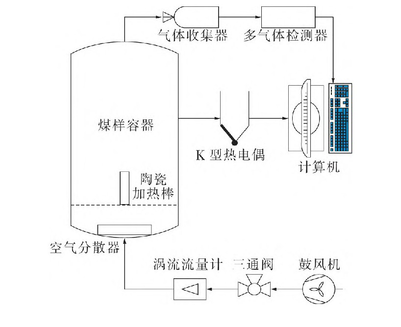
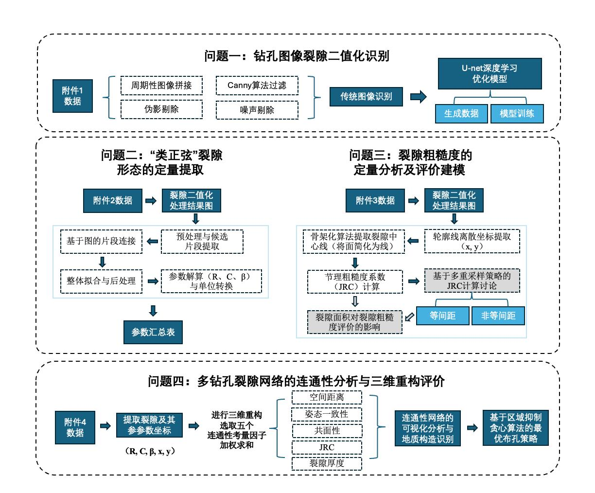
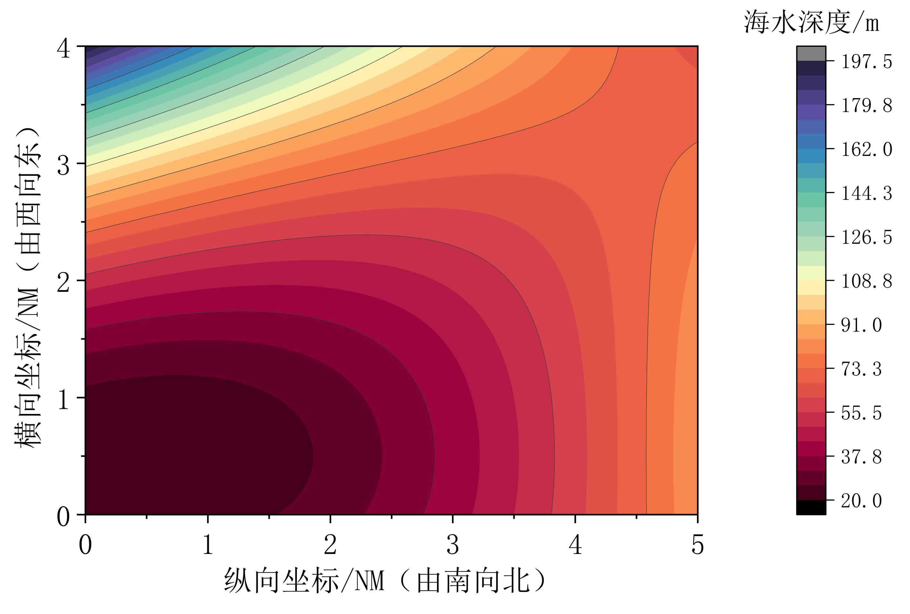
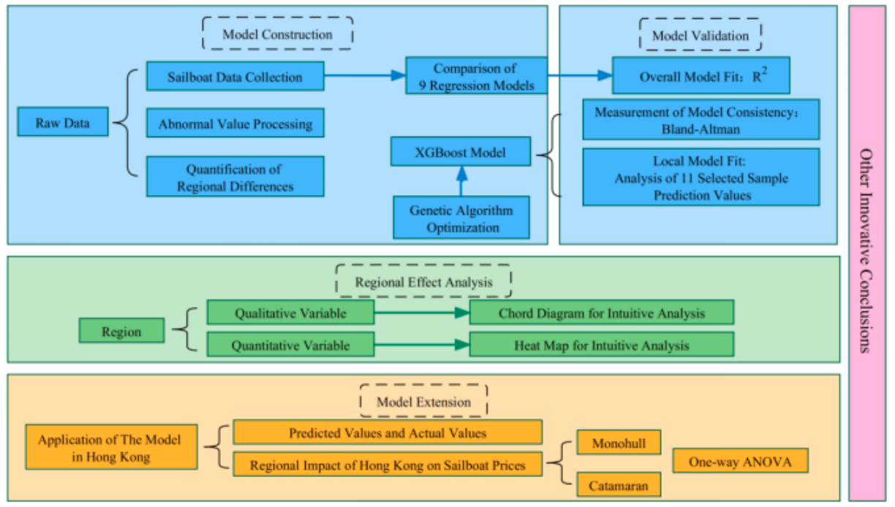
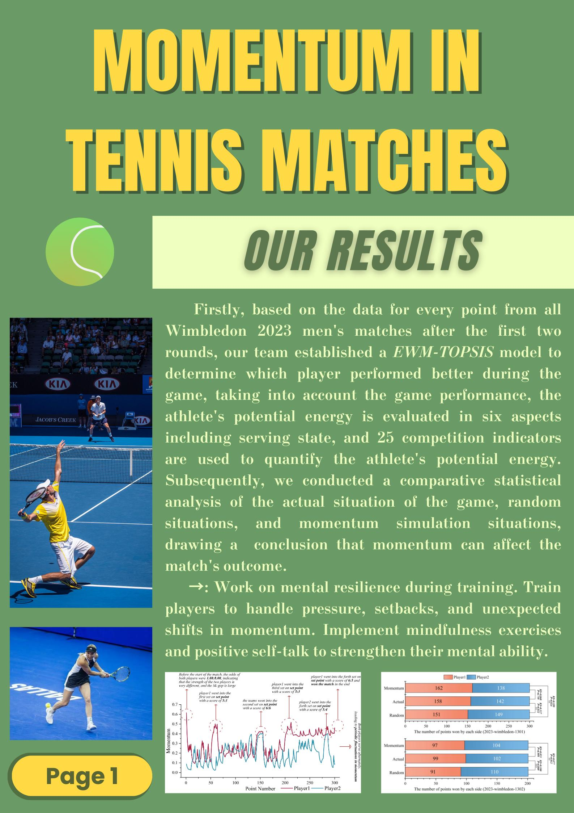
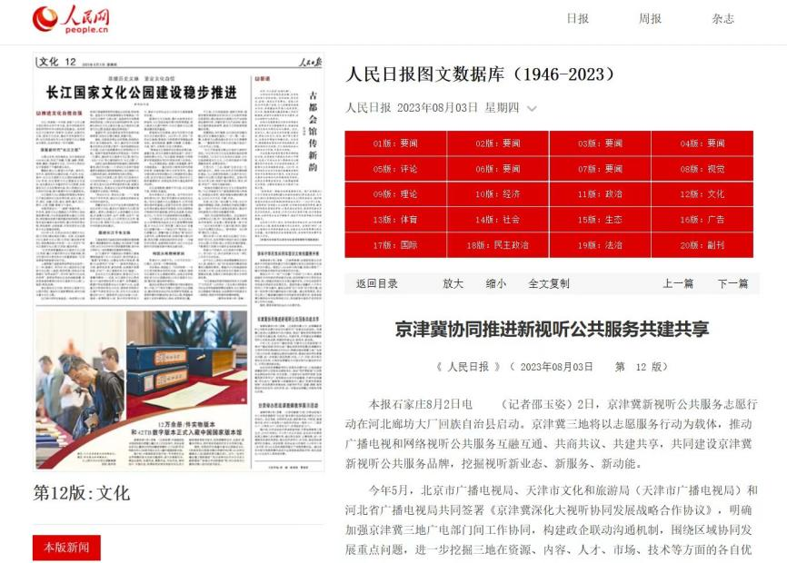








# 👋 欢迎

我现为**厦门大学社会学**硕士生（推免入学，提前1年毕业，2027届应届生），师从[徐延辉教授](https://ssa.xmu.edu.cn/info/1190/1152.htm)。本科毕业于**中国地质大学（北京）经济学**专业，师从[李莉教授](https://scholar.cugb.edu.cn/scholar/scholarDetail/620.shtml)。

我的研究方向聚焦**能源经济学、环境经济学**，目前求职方向为 **产品经理 / 产品策划**。

📌 **工作经历**：
- **2025.12 - 至今**：[快手](https://www.kuaishou.com/) 海外用户增长产品实习生
- **2025.02 - 2025.08**：快手 商业化策略实习生  
- **2024.07 - 2024.11**：[好未来](https://www.100tal.com/) 商业数据分析实习生

欢迎通过 [📧 邮件](mailto:zorange411@gmail.com) 联系我。

# 🔥 近期动态

| 时间 | 事件 |
|------|------|
| **2025.12** | 🎉 加入快手担任**海外用户增长产品实习生** |
| 2025.09 | 🎉 新项目 [《100次随机抽样》](https://www.xiaohongshu.com/discovery/item/68da1be9000000001201dc9a?source=webshare&xhsshare=pc_web&xsec_token=ABgJCDCD9AltTgJKf-AJywUkvGNeirUbVUT4hY8BMjDXI=&xsec_source=pc_share) 立项（筹备推进中，欢迎报名） |
| 2025.09 | 🎉 论文发表于 **Environment, Development and Sustainability** (一作+通讯，JCR二区，IF=4.2) |
| 2025.09 | 🎉 论文发表于 **西安科技大学学报** (合作，北大中文核心) |
| 2025.05 | 💡 知乎专栏：[时间管理的金融工程学：一个拖延者的理论重构](https://zhuanlan.zhihu.com/p/1892310880248640651) |
| 2024.10 | 🎖️ 获得**国家奖学金** (TOP 0.2%) |
| 2024.09 | 📖 保研至**厦门大学**攻读硕士学位 |
| 2024.08 | 🎉 论文发表于 **Sustainable Futures** (一作，中科院二区，IF=4.9) |
| 2024.08 | 🎉 论文发表于 **Journal of Cleaner Production** (一作，中科院一区TOP，IF=10.0) |
| 2024.06 | 🎉 论文发表于 **Science of The Total Environment** (三作，中科院一区TOP，IF=8.0) |

# 📖 教育经历

| 时间 | 学校 | 学位 | 成果 |
|------|------|------|------|
| **2025.09 - 2027.06** | 厦门大学 | 社会学硕士 （推免，提前1年毕业） | **GPA 3.81/4.0** (前20%)，已发表 5 篇学术论文 |
| 2021.09 - 2025.06 | 中国地质大学（北京） | 经济学学士 | **GPA 3.84/4.0** (前5%)，国家奖学金 (TOP 0.2%)，校三好学生 |

# 💻 实习经历

快手

  
*2025.12 - 至今*, [快手](https://www.kuaishou.com/), 北京.

- **海外用户增长产品实习生**
- **2026 世界杯拉新与回流专项**：面向巴西市场设计“赛事竞猜+社交裂变”玩法，围绕竞猜主玩法设计支线增长方案，补足长赛程下的分享和保活场景。负责：
  - **炫耀海报（高优转化）**：针对WhatsApp生态，挖掘用户“赢球炫耀/输球自嘲”社交情绪，设计“战神/翻车”等炫耀海报，构建“竞猜-生成海报-站外分享-点击回流”链路。
  - **每日抽奖（疲劳期保活）**：针对休赛期/非巴西队赛期的DAU回落痛点，设计“每日1次免费抽奖”来提高活动留存，并将邀请好友、看广告等作为额外抽奖的方式，实现留存、裂变、商业化的结合。
- **“早安问候”内容向裂变活动（开发中）**：针对下沉用户“网赚分享羞耻感”及传统裂变“异步奖励”转化率低的问题，结合巴西 WhatsApp 早安文化，将利益诱导重构为“带微小金币的早安卡片(主客同步即时奖励)”。同时优化定向推荐策略，精准圈选“高亲密度+潜在新回”用户，配合每日 3 次防刷频控，预期在消解分享包袱的同时提升人均分享次数、用户粘性(次留七留)、分享拉端率。
- **WhatsApp召回与素材策略**：针对流失用户圈选不准与触达转化低的问题，构建“人群×素材”精细化触达模型。人群端，基于UID/DID映射解决一机多号偏差，优先圈选未卸载的沉默用户；素材端，引入PIX、账单、熟人ID等设计元素。最终在不损耗次留/七留的前提下，召回转化率由6%提升至11%，获客成本降至0.3美元。

快手

  
*2025.02 - 2025.08*, [快手](https://www.kuaishou.com/new-reco), 北京.

- **商业化策略实习生**
- **多模态AI广告打标系统**：应对精细化运营导致的广告物料打标效率瓶颈，梳理H5落地页特征提取链路。依托Luigi平台设计多模态AI自动化打标策略，完成Prompt调优与业务接口联调。将单条物料打标耗时由小时级压缩至分钟级（效率提升90%），准确率稳定在95%以上。
- **业务诊断与归因分析**：搭建“客户×产品×点位×内容×定向×模型”分析框架。基于KwaiBI构建多维数据看板，输出通信行业头部广告主的投放效果归因报告，提炼策略优化点并推动业务线执行，产出对外双周报。

好未来

  
*2024.07 - 2024.11*, [好未来教育集团](https://www.100tal.com/), 北京.

- **商业数据分析实习生**
- **智能客诉分析系统**：针对海量非结构化客诉文本处理低效痛点，基于Dify平台搭建多Agent协同工作流。引入RAG技术挂载业务知识库，实现客诉情绪精准识别与工单自动标签分类。单月节省人工打标成本约4 PD，客诉初步处理效率提升80%。
- **增长漏斗模型构建与异动归因**：梳理客资从“触达-留资-转化”全链路漏斗，对核心流失节点进行因果定量分析。搭建多校区健康度诊断模型，精准预警3次客资异常波动，并协同运营团队完成触点干预与策略纠偏。

# 🛠️ 技能与工具

  

    <strong>产品能力</strong> 
    从0到1产品规划 • PRD撰写 • Figma 原型设计
  

  

    <strong>数据分析</strong> 
    SQL 数据提取 • 漏斗分析 • BI 看板可视化
  

  

    <strong>AI 应用</strong> 
    Prompt 工程 • RAG • 多Agent 协同 • 工作流编排
  

  

    <strong>语言</strong> 
    英语 CET-6 (509)
  

# 📝 学术论文与个人博客

Journal of Cleaner Production

[The coordinated development among economy, society, energy, and environment and their impacts on public health in China's cities](https://www.sciencedirect.com/science/article/abs/pii/S0959652624028919?via%3Dihub=)

**Cheng Zhang**, Meiyu Jiang, Fujie Yang, Yuehan Wang, Yaxin Xu, Sihan Lin, Li Li, Yalin Lei, Sanmang Wu, Jiao Wang

[**Project**](https://www.sciencedirect.com/science/article/abs/pii/S0959652624028919?via%3Dihub=) | Journal of Cleaner Production, Volume 472, 2024, doi: 10.1016/j.jclepro.2024.143442.(第一作者，中科院一区TOP, IF=10.0)

Sustainable Futures

[The impact of digital economy on energy conservation and emission reduction: evidence from prefecture-level cities in China](https://www.sciencedirect.com/science/article/pii/S2666188824001370#abs0001)

**Cheng Zhang**, Yirui Zhang, Hua Zhang, Jiaying You, Xinke Lv, Xinyu Cheng

[**Project**](https://www.sciencedirect.com/science/article/pii/S2666188824001370#abs0001) | Sustainable Futures, Volume 8, 2024, doi: 10.1016/j.sftr.2024.100288.(第一作者，中科院二区, IF=4.9)

Environment, Development and Sustainability

[How new quality productive forces influenced the Urban-Rural income gap: evidence from prefectural cities in China](https://link.springer.com/article/10.1007/s10668-025-06929-3)

**Cheng Zhang**, Jiayi Hu, Chenlin Song, Yutao Lu 

[**Project**](https://link.springer.com/article/10.1007/s10668-025-06929-3) | Environment, Development and Sustainability, 2025, doi: 10.1007/s10668-025-06929-3.(第一作者&通讯作者，JCR二区, IF=4.2)

Science of The Total Environment

  
[Spatio-temporal differentiation characteristics and the influencing factors of PM2.5 emissions from coal consumption in Central Plains Urban Agglomeration](https://www.sciencedirect.com/science/article/abs/pii/S0048969724039251#preview-section-references)

Fujie Yang, Jiayi Yu, **Cheng Zhang**, Li Li, Yalin Lei, Sanmang Wu, Yibo Wang, Xin Zhang

[**Project**](https://www.sciencedirect.com/science/article/abs/pii/S0048969724039251#preview-section-references) | Science of The Total Environment, Volume 945, 2024, doi: 10.1016/j.scitotenv.2024.173778. (第三作者，中科院一区TOP, IF=8.0)

西安科技大学学报

  
[氧通量对新疆苇湖梁煤燃烧过程及其判定指标的影响](https://kns.cnki.net/kcms2/article/abstract?v=krTYG2tdvzpMC4vVi_woNCQdNE4dLJceqEBGwZz9qTlBH6hLL0ciOh1iWixTEpJ8lCDuxb4aaiewpvEkUtC9ghF14KbMkRJ9As-LOW6gqvq2FLx83nqG6hWbsOdClVA5TyzEuOrY_cnb_kyuHbYCJnmGSS1fFA-QcpXJg0HFr98=&uniplatform=NZKPT)

卢宇涛, 张国强, 张飞, **张丞**, 苏贺涛, 胡佳怡

[**Project**](https://kns.cnki.net/kcms2/article/abstract?v=krTYG2tdvzpMC4vVi_woNCQdNE4dLJceqEBGwZz9qTlBH6hLL0ciOh1iWixTEpJ8lCDuxb4aaiewpvEkUtC9ghF14KbMkRJ9As-LOW6gqvq2FLx83nqG6hWbsOdClVA5TyzEuOrY_cnb_kyuHbYCJnmGSS1fFA-QcpXJg0HFr98=&uniplatform=NZKPT) | 西安科技大学学报, 2025, doi:  10.13800/j.cnki.xakjdxxb.2025.0519. (合作作者，北大中文核心)

知乎

  
["时间管理的金融工程学：一个拖延者的理论重构——关于QE、QT与人生债务的跨学科对话"](https://zhuanlan.zhihu.com/p/1892310880248640651).

张丞，DeepSeek. 2025.04

# 🎖️ 项目经历

B端AI产品化

  
**1.[地质勘探围岩智能识别系统 (B端AI产品化实践)](https://jcn5rfr6x2z1.feishu.cn/file/VxzCbZVfJoN0NExN09AcjjbHn7X)**
- 全国研究生数学建模竞赛，全国二等奖
- 针对人工围岩识别效率低、决策无量化支撑的痛点，采用逆向生成策略解决样本缺失问题，设计「传统图像处理+U-Net」混合模型的产品化落地逻辑，实现像素级分割精度R²>90%。搭建三维数字孪生与不确定性评估模型，为钻孔布局规划提供数据驱动的决策辅助，模型解释力超75%。

策略产品化

  
**2.[海底地形探测智能规划算法 (策略产品化实践)](https://jcn5rfr6x2z1.feishu.cn/file/Bf5tbGl3Dogednxx8tEcNhG7nSd)**
- 全国大学生数学建模竞赛，北京市一等奖
- 针对探测任务中覆盖率、成本与质量的冲突，抽象核心约束条件（地形坡度，测幅等）构建路径规划数学模型。引入多目标遗传算法进行寻优迭代，输出在保障>97%覆盖率下将漏测占比压缩至2.72%的较优路径方案，验证了复杂业务约束下的策略可行性。

数学建模

  
**3.[基于XGBoost的二手帆船价格预测与影响因素分析](https://jcn5rfr6x2z1.feishu.cn/file/KMb0bPgF1ohnW9xsDTvc9szEnib)**
- 美国大学生数学建模竞赛，Honorable Mention
- 为解决二手帆船市场定价难、决策慢的问题，构建了集精准预测与商业洞察于一体的数据解决方案。通过评估9种机器学习模型，选定并优化XGBoost算法构建高精度价格预测模型(R²=0.887)，并量化验证了“区域效应”对价格的影响。最终将模型洞察应用于香港市场，为经纪商提供了含数据可视化的分析报告与定价策略。

数学建模

**4.[基于机器学习的体育竞赛动量演化与关键节点预测研究](https://jcn5rfr6x2z1.feishu.cn/file/X03GbFmhEolWqnxw0rScB8EVnbd)**
- 美国大学生数学建模竞赛，Honorable Mention
- 为解决体育竞技中“势能”的抽象概念难以量化分析的难题，设计了从定义到预测的完整分析框架。通过熵权TOPSIS法整合21项指标构建“动量”评估模型，首次将比赛“势能”数据化；并搭建IGSRF模型预测关键转折点，准确率达89.23%，且成功泛化至美网、世乒赛等不同赛事，验证了其鲁棒性。

社会实践

**5.[智慧赋能数字乡村](https://jcn5rfr6x2z1.feishu.cn/file/SCrDbww3KoDwyTxl3aqc4JGEnPh)**
- 社会实践类，校级一等奖
- 调研：发放1629份问卷，利用SPSS分析数据，了解老年群体智能手机使用现状与数字素养能力现状
- 实践：走进北京市4个行政区，开展科技助老活动15场，服务时长426小时，服务群体2000余人
- 宣传：事迹得到中国青年报、北京日报等媒体的报道，实践纪录片播放量超过50000，开发“银龄智慧助手”小程序

