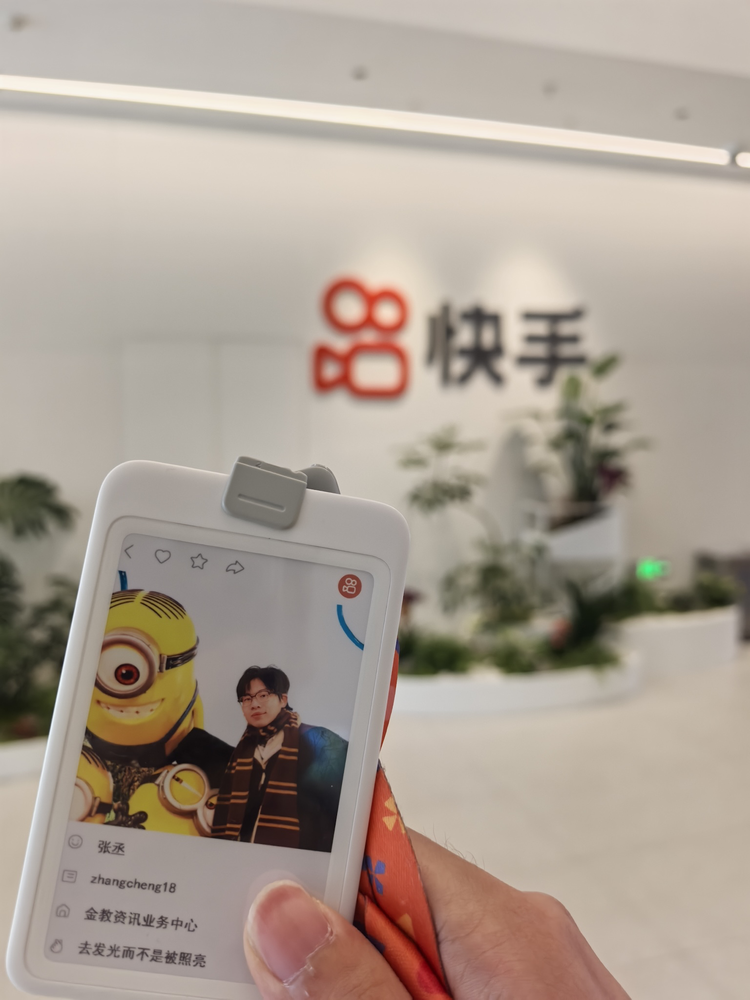
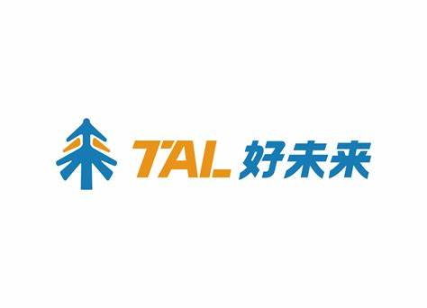
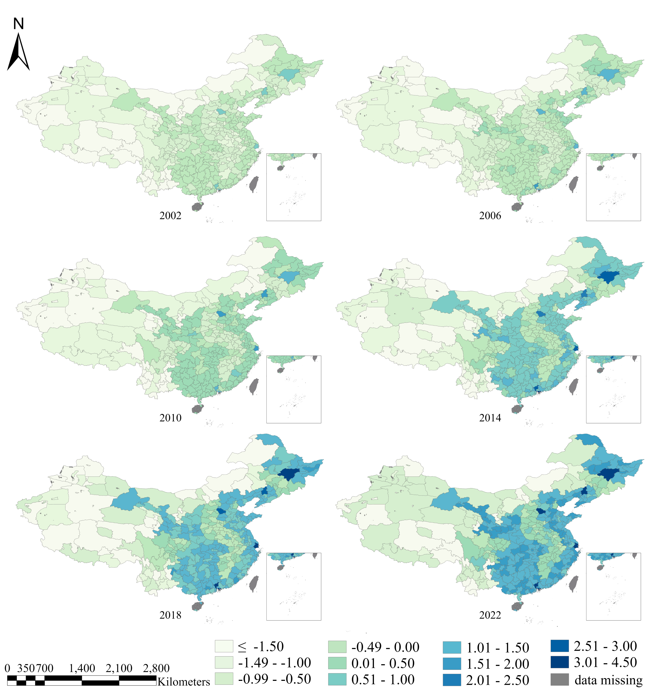
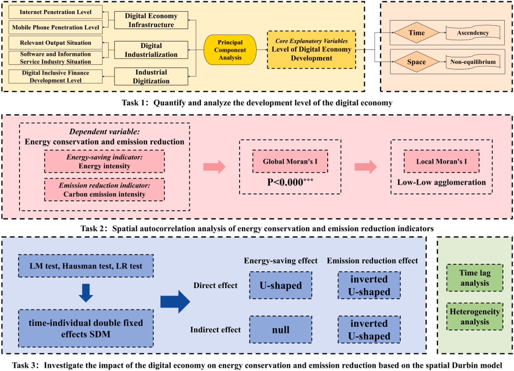
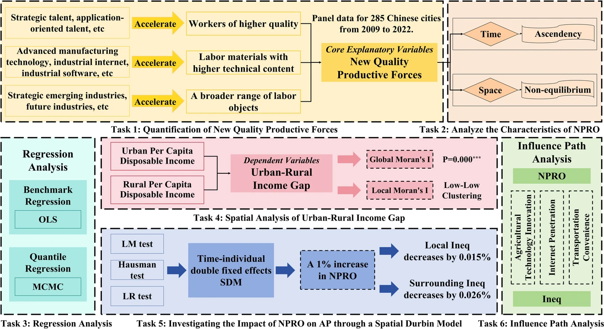
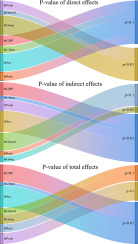








# 欢迎! 
> 我现为[厦门大学社会学](https://ssa.xmu.edu.cn/)硕士生（推免，提前1年毕业，2027届应届生），有幸师从[徐延辉教授](https://ssa.xmu.edu.cn/info/1190/1152.htm)。本科毕业于[中国地质大学（北京）经济学](https://sem.cugb.edu.cn/)专业，有幸师从[李莉教授](https://scholar.cugb.edu.cn/scholar/scholarDetail/620.shtml)。我的研究兴趣涵盖能源经济学、环境经济学等领域，同时我的求职方向为**产品经理/产品策划**。
> 
> 2025年12月至今，我在[快手](https://www.kuaishou.com/)担任海外用户增长产品实习生，聚焦拉新与回流专项；
> 2025年2月至8月期间，我在快手担任商业化策略实习生，探索AI打标系统与数据归因；
> 2024年7月至11月期间，我在[好未来](https://www.100tal.com/)担任商业数据分析实习生，负责客诉智能分析与漏斗模型搭建。
> 
> 如果您对我的研究或产品实践工作感兴趣，欢迎通过[邮箱](mailto:zorange411@gmail.com)与我联系。希望以上介绍能帮助您更好地了解我的学术背景与业务实践。

# 🔥 近期动态
- *2025.12*：&nbsp;🎉 加入快手担任海外用户增长产品实习生.
- *2025.09*：&nbsp;🎉 新项目[《100次随机抽样》](https://www.xiaohongshu.com/discovery/item/68da1be9000000001201dc9a?source=webshare&xhsshare=pc_web&xsec_token=ABgJCDCD9AltTgJKf-AJywUkvGNeirUbVUT4hY8BMjDXI=&xsec_source=pc_share)立项（筹备、推进中，欢迎报名）.
- *2025.09*：&nbsp;🎉 学术论文发表于**Environment, Development and Sustainability** (第一作者+通讯作者，JCR二区，IF=4.2).
- *2025.09*：&nbsp;🎉 学术论文发表于**西安科技大学学报** (合作作者，北大中文核心).
- *2025.05*: &nbsp;💡 新的思考["时间管理的金融工程学：一个拖延者的理论重构——关于QE、QT与人生债务的跨学科对话"](https://zhuanlan.zhihu.com/p/1892310880248640651).
- *2024.10*: &nbsp;🎖️ 获得本科生**国家奖学金** (TOP 0.2%).
- *2024.09*: &nbsp;📖 保研至**厦门大学**攻读硕士学位.
- *2024.08*: &nbsp;🎉 学术论文发表于 **Sustainable Futures** (第一作者，中科院二区，IF=4.9). 
- *2024.08*: &nbsp;🎉 学术论文发表于 **Journal of Cleaner Production** (第一作者，中科院一区TOP，IF=10.0).
- *2024.06*: &nbsp;🎉 学术论文发表于 **Science of The Total Environment** (第三作者，中科院一区TOP，IF=8.0).

# 📖 教育经历
- *2025.09 - 2027.06*, 厦门大学，社会学硕士学位（推免，提前1年毕业），导师：徐延辉教授
- *2021.09 - 2025.06*, 中国地质大学（北京），经济学学士学位，导师：李莉教授

# 💻 实习经历

快手

  
*2025.12 - 至今*, [快手](https://www.kuaishou.com/), 北京.

- **海外用户增长产品实习生**
- **2026 世界杯拉新与回流专项**：面向巴西市场设计“赛事竞猜+社交裂变”玩法，预期为巴西大盘贡献超20w新客及回流增量。独立负责：
  - **炫耀海报（高优转化）**：挖掘WhatsApp生态“赢球炫耀/输球自嘲”社交情绪，设计分享海报，构建“竞猜-生成海报-站外分享-点击回流”链路。
  - **每日抽奖（疲劳期保活）**：针对非赛期DAU回落，设计免费抽奖提高留存，并叠加邀请好友、看广告等额外抽奖方式，实现留存与裂变、商业化的结合。
- **定向推荐策略优化**：针对静态关系链推荐转化低的问题，将单一特征升级为“动态互动时间因子+同好内容图谱”，精准圈选高亲密且沉默用户，降低分享决策阻力。
- **裂变卡片优化**：引入巴西PIX提现等本地化元素叠加“熟人ID+稀缺感文案”，核心指标分享拉端率（PV）绝对提升绝对提升至4.4%。
- **站外召回链路闭环**：基于UID/DID映射构建WhatsApp外站召回体系。通过受众分层与Push素材迭代，召回转化率由6%提升至11%，获客成本降至0.4美元。

快手

  
*2025.02 - 2025.08*, [快手](https://www.kuaishou.com/new-reco), 北京.

- **商业化策略实习生**
- **多模态AI广告打标系统**：应对精细化运营导致的打标效率瓶颈，梳理H5落地页特征提取链路。依托Luigi平台设计多模态AI自动化打标策略，单条物料耗时由小时级压缩至分钟级（效率提升90%），准确率稳定在95%以上。
- **业务诊断与归因分析**：搭建“客户×产品×点位×矩阵×内容×定向×模型”分析框架。基于KwaiBI构建多维数据看板，独立输出通信行业头部广告主投放效果归因报告，提炼优化点并推动业务线执行。

好未来

  
*2024.07 - 2024.11*, [好未来教育集团](https://www.100tal.com/), 北京.

- **商业数据分析实习生**
- **智能客诉分析系统**：针对海量非结构化客诉文本处理低效痛点，基于Dify平台搭建多Agent协同工作流。引入RAG技术挂载业务知识库，实现客诉情绪精准识别与工单自动分类。单月节省人工打标成本约4PD，处理效率提升80%。
- **增长漏斗模型构建与异动归因**：梳理客资从“触达-留资-转化”全链路漏斗，对核心流失节点进行因果定量分析。搭建多校区健康度诊断模型，精准预警3次客资异常波动，并协同运营完成策略纠偏。

# 📝 学术论文与个人博客

Journal of Cleaner Production

[The coordinated development among economy, society, energy, and environment and their impacts on public health in China's cities](https://www.sciencedirect.com/science/article/abs/pii/S0959652624028919?via%3Dihub=)

**Cheng Zhang**, Meiyu Jiang, Fujie Yang, Yuehan Wang, Yaxin Xu, Sihan Lin, Li Li, Yalin Lei, Sanmang Wu, Jiao Wang

[**Project**](https://www.sciencedirect.com/science/article/abs/pii/S0959652624028919?via%3Dihub=) | Journal of Cleaner Production, Volume 472, 2024, doi: 10.1016/j.jclepro.2024.143442.(第一作者，中科院一区TOP, IF=10.0)

Sustainable Futures

[The impact of digital economy on energy conservation and emission reduction: evidence from prefecture-level cities in China](https://www.sciencedirect.com/science/article/pii/S2666188824001370#abs0001)

**Cheng Zhang**, Yirui Zhang, Hua Zhang, Jiaying You, Xinke Lv, Xinyu Cheng

[**Project**](https://www.sciencedirect.com/science/article/pii/S2666188824001370#abs0001) | Sustainable Futures, Volume 8, 2024, doi: 10.1016/j.sftr.2024.100288.(第一作者，中科院二区, IF=4.9)

Environment, Development and Sustainability

[How new quality productive forces influenced the Urban-Rural income gap: evidence from prefectural cities in China](https://link.springer.com/article/10.1007/s10668-025-06929-3)

**Cheng Zhang**, Jiayi Hu, Chenlin Song, Yutao Lu 

[**Project**](https://link.springer.com/article/10.1007/s10668-025-06929-3) | Environment, Development and Sustainability, 2025, doi: 10.1007/s10668-025-06929-3.(第一作者&通讯作者，JCR二区, IF=4.2)

Science of The Total Environment

  
[Spatio-temporal differentiation characteristics and the influencing factors of PM2.5 emissions from coal consumption in Central Plains Urban Agglomeration](https://www.sciencedirect.com/science/article/abs/pii/S0048969724039251#preview-section-references)

Fujie Yang, Jiayi Yu, **Cheng Zhang**, Li Li, Yalin Lei, Sanmang Wu, Yibo Wang, Xin Zhang

[**Project**](https://www.sciencedirect.com/science/article/abs/pii/S0048969724039251#preview-section-references) | Science of The Total Environment, Volume 945, 2024, doi: 10.1016/j.scitotenv.2024.173778. (第三作者，中科院一区TOP, IF=8.0)

西安科技大学学报

  
[氧通量对新疆苇湖梁煤燃烧过程及其判定指标的影响](https://kns.cnki.net/kcms2/article/abstract?v=krTYG2tdvzpMC4vVi_woNCQdNE4dLJceqEBGwZz9qTlBH6hLL0ciOh1iWixTEpJ8lCDuxb4aaiewpvEkUtC9ghF14KbMkRJ9As-LOW6gqvq2FLx83nqG6hWbsOdClVA5TyzEuOrY_cnb_kyuHbYCJnmGSS1fFA-QcpXJg0HFr98=&uniplatform=NZKPT)

卢宇涛, 张国强, 张飞, **张丞**, 苏贺涛, 胡佳怡

[**Project**]([https://www.sciencedirect.com/science/article/abs/pii/S0048969724039251#preview-section-references](https://kns.cnki.net/kcms2/article/abstract?v=krTYG2tdvzpMC4vVi_woNCQdNE4dLJceqEBGwZz9qTlBH6hLL0ciOh1iWixTEpJ8lCDuxb4aaiewpvEkUtC9ghF14KbMkRJ9As-LOW6gqvq2FLx83nqG6hWbsOdClVA5TyzEuOrY_cnb_kyuHbYCJnmGSS1fFA-QcpXJg0HFr98=&uniplatform=NZKPT)) | 西安科技大学学报, 2025, doi:  10.13800/j.cnki.xakjdxxb.2025.0519. (合作作者，北大中文核心)

知乎

  
["时间管理的金融工程学：一个拖延者的理论重构——关于QE、QT与人生债务的跨学科对话"](https://zhuanlan.zhihu.com/p/1892310880248640651).

张丞，DeepSeek. 2025.04

# 🎖️ 项目经历

B端AI产品化

  
**1.[地质勘探围岩智能识别系统 (B端AI产品化实践)](https://jcn5rfr6x2z1.feishu.cn/file/VxzCbZVfJoN0NExN09AcjjbHn7X)**
- 全国研究生数学建模竞赛，全国二等奖
- 针对人工围岩识别效率低、决策无量化支撑的痛点，采用逆向生成策略解决样本缺失问题，设计「传统图像处理+U-Net」混合模型的产品化落地逻辑，实现像素级分割精度R²>90%。搭建三维数字孪生与不确定性评估模型，为钻孔布局规划提供数据驱动的决策辅助，模型解释力超75%。

策略产品化

  
**2.[海底地形探测智能规划算法 (策略产品化实践)](https://jcn5rfr6x2z1.feishu.cn/file/Bf5tbGl3Dogednxx8tEcNhG7nSd)**
- 全国大学生数学建模竞赛，北京市一等奖
- 针对探测任务中覆盖率、成本与质量的冲突，抽象核心约束条件（地形坡度，测幅等）构建路径规划数学模型。引入多目标遗传算法进行寻优迭代，输出在保障>97%覆盖率下将漏测占比压缩至2.72%的较优路径方案，验证了复杂业务约束下的策略可行性。

数学建模

  
**3.[基于XGBoost的二手帆船价格预测与影响因素分析](https://jcn5rfr6x2z1.feishu.cn/file/KMb0bPgF1ohnW9xsDTvc9szEnib)**
- 美国大学生数学建模竞赛，Honorable Mention
- 为解决二手帆船市场定价难、决策慢的问题，构建了集精准预测与商业洞察于一体的数据解决方案。通过评估9种机器学习模型，选定并优化XGBoost算法构建高精度价格预测模型(R²=0.887)，并量化验证了“区域效应”对价格的影响。最终将模型洞察应用于香港市场，为经纪商提供了含数据可视化的分析报告与定价策略。

数学建模

**4.[基于机器学习的体育竞赛动量演化与关键节点预测研究](https://jcn5rfr6x2z1.feishu.cn/file/X03GbFmhEolWqnxw0rScB8EVnbd)**
- 美国大学生数学建模竞赛，Honorable Mention
- 为解决体育竞技中“势能”的抽象概念难以量化分析的难题，设计了从定义到预测的完整分析框架。通过熵权TOPSIS法整合21项指标构建“动量”评估模型，首次将比赛“势能”数据化；并搭建IGSRF模型预测关键转折点，准确率达89.23%，且成功泛化至美网、世乒赛等不同赛事，验证了其鲁棒性。

社会实践

**5.[智慧赋能数字乡村](https://jcn5rfr6x2z1.feishu.cn/file/SCrDbww3KoDwyTxl3aqc4JGEnPh)**
- 社会实践类，校级一等奖
- 调研：发放1629份问卷，利用SPSS分析数据，了解老年群体智能手机使用现状与数字素养能力现状
- 实践：走进北京市4个行政区，开展科技助老活动15场，服务时长426小时，服务群体2000余人
- 宣传：事迹得到中国青年报、北京日报等媒体的报道，实践纪录片播放量超过50000，开发“银龄智慧助手”小程序

